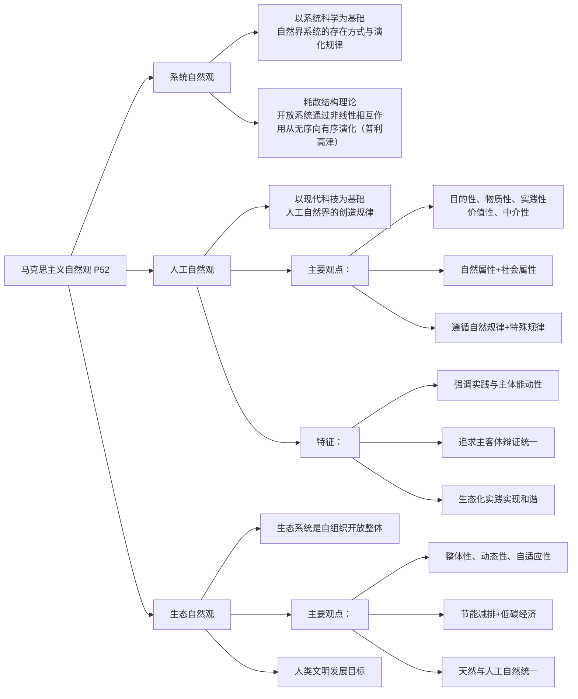
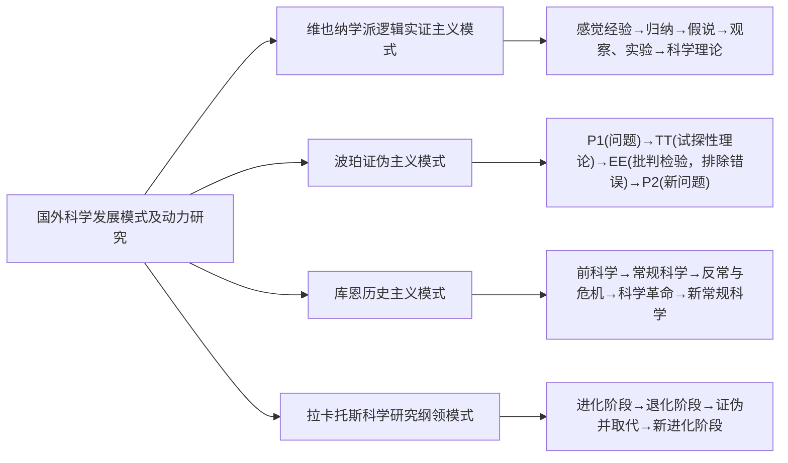
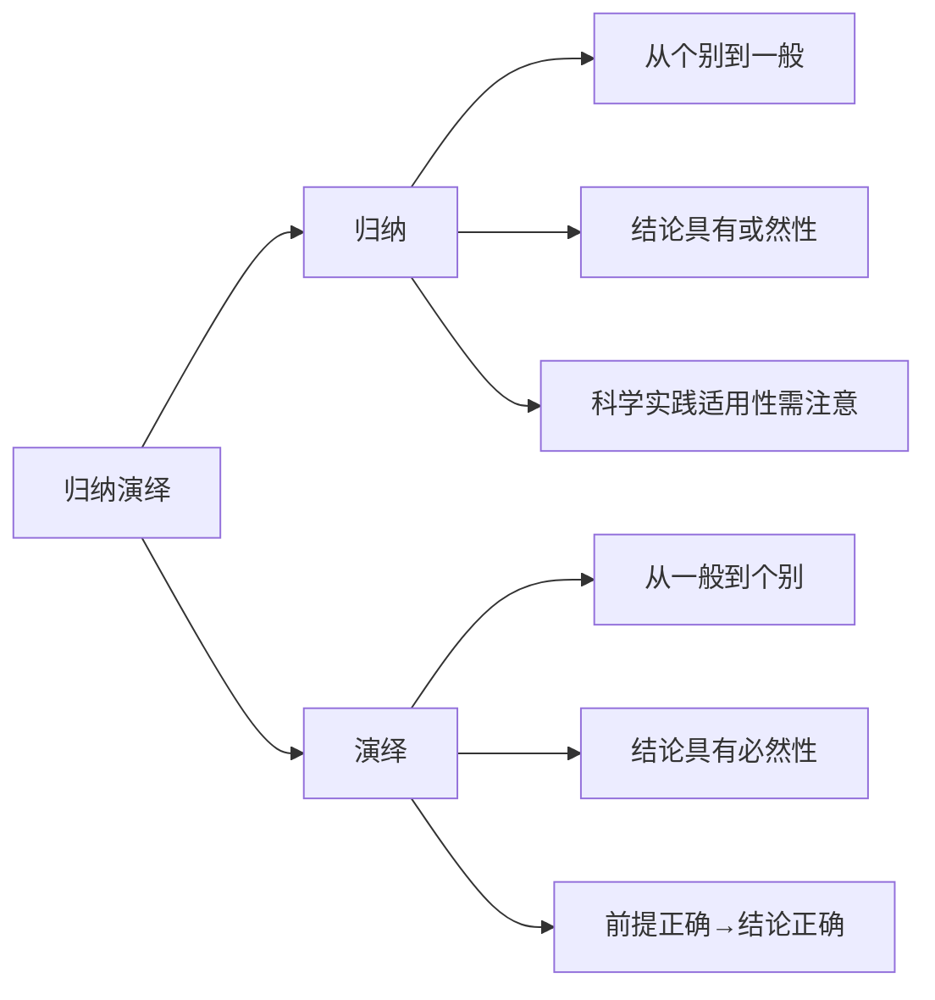
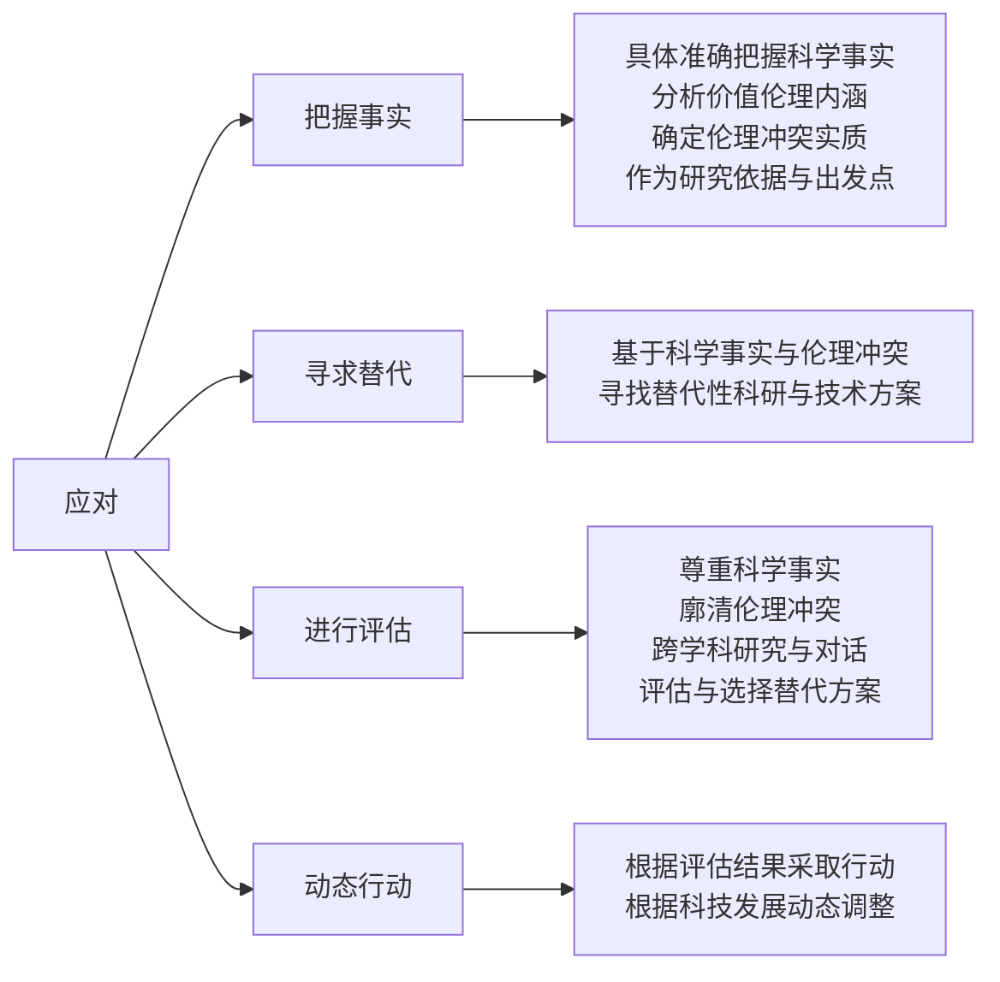
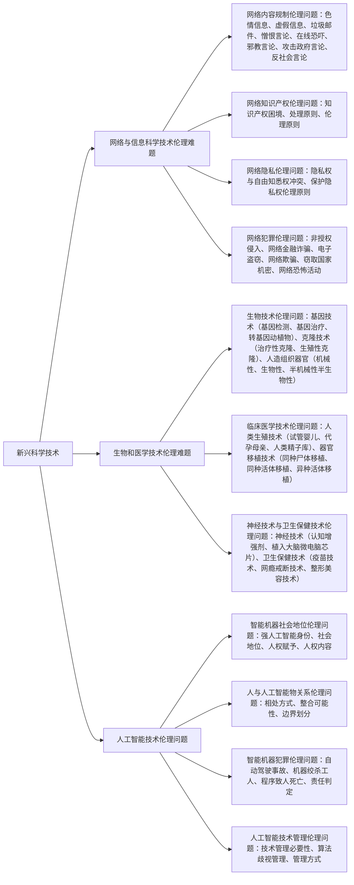
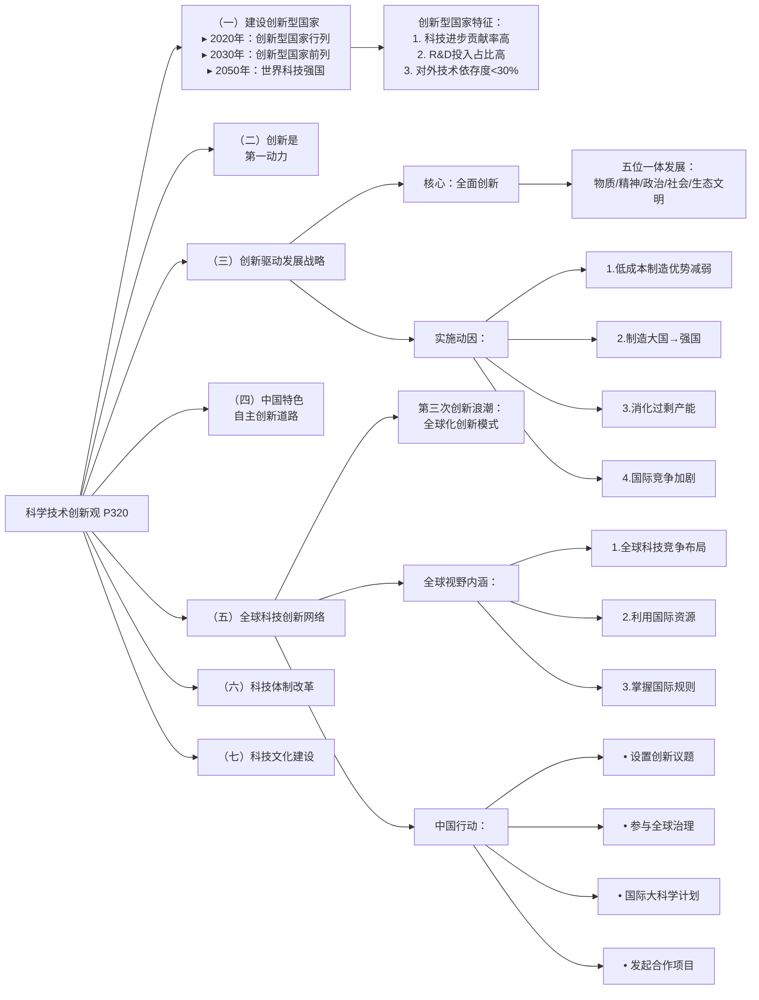

# 题型

 |题型|总分|
 |---|---|
 |选择题|10×2 = 20分| 	
 |简答题|4×5 = 20分|
 |论述题|30×2 = 60分|	

# 选择题

## 押题

|观点/书|人/时期|
|---|---|
|《寂静的春天》|卡逊|
|实证主义|孔德|
|知识就是力量|弗朗西斯·培根|
|《科学：无尽的前沿》|万·布什/拉什|
|世界本源是由水构成的|泰勒斯|
|科学发展模式为“P-TT-EE-P”&证伪主义（否定后件式）|波普尔|
|第一个提出发工资/提供经费支持/给科学家发薪水|法兰西皇家科学院/法国科学院|
|耗散结构理论|伊里亚·普里戈金/普利高津|
|《第三次浪潮》是信息革命阶段|托夫勒|
|《单向度的人》|马尔库塞|

命中考题70%

## 题库

|观点/书|人/时期|
|---|---|
|《寂静的春天》|卡逊|
|实证主义|孔德|
|知识就是力量|弗朗西斯·培根|
|《科学：无尽的前沿》|万·布什/拉什|
|世界本源是由水构成的|泰勒斯|
|科学发展模式为“P-TT-EE-P”&证伪主义（否定后件式）|波普尔|
|第一个提出发工资/提供经费支持/给科学家发薪水|法兰西皇家科学院/法国科学院|
|耗散结构理论|伊里亚·普里戈金/普利高津|
|《第三次浪潮》是信息革命阶段|托夫勒|
|《单向度的人》|马尔库塞|
|实证主义|孔德|
|逻辑实证主义|维特根斯坦|
|证伪主义|波珀/波普尔|
|历史主义|库恩|
|精致证伪主义|拉卡托斯|
|机械唯物主义自然观|16-18世纪|
|地心主义/地心说|托勒密|
|世界本源是由无限构成的|阿那克西曼德|
|《自然辩证法》|恩格斯|
|“星云假说”|康德|
|国家创新体系|弗里曼|
|（机械观）数原本论|毕达哥拉斯|
|位移运动说|亚里士多德|
|在《1844年经济学哲学手稿》中首次提出“劳动异化”的概念|马克思|
|第一个建立系和研究生院制度|美国|
|“器官投影说”：人和观点对应起来|恩斯特·卡普|
|《两种文化》(科学文化与人文文化)|C.P.斯诺|
|具体分析“技术中心论”是错误的|海德格尔|
|《十七世纪英格兰的科学、技术与社会》开创科学社会学研究的新领域|罗伯特.K.默顿|
|《增长的极限》|米杜斯|
|演绎-律则模型（DN模型）|亨普尔|
|古代原子论|德谟克里特|
|地动说|阿里斯塔克|
|地质“渐变论”|赖尔|
|《科学史及其与哲学和宗教的关系》|西耳·丹皮尔|
|《后工业社会》|丹尼尔贝尔|
|《知识社会》|罗伯特E莱恩|

# 简答题

复习资料命中考题50%：巴斯德象限、归纳演绎

## 巴斯德象限

美国学者斯托克斯(D. E. Stokes)1997年提出科学研究的 **“应用与基础”** 二维模型，用法国科学家巴斯德的基础研究有较强的应用导向为例说明了科研过程中的认识世界和知识应用的目的可以并存的现象。后用巴斯德象限泛指应用引发的基础研究。

**核心定义**：巴斯德象限是指那些既追求纯粹的科学知识探索，又同时关注实际应用的科学研究领域。它强调基础研究与应用研究之间的交叉融合，以法国科学家路易·巴斯德（Louis Pasteur）的研究为例，他的工作既推动了微生物学等基础科学的发展，又在疫苗研发、食品保存等实际应用中取得了重大突破。

**重要性**：巴斯德象限的研究模式被认为是现代科技创新的重要驱动力，它平衡了基础研究的深度和应用研究的广度，能够更好地满足社会和经济发展的需求，同时推动科学前沿的探索。

## 马克思主义自然观 P52

系统自然观、人工自然观和生态自然观是马克思主义自然观发展的当代形态，是中国马克思主义自然观的重要组成部分。

1. 系统自然观

系统自然观是以系统科学等为基础，对自然界系统的存在方式和演化规律的概括和总结，是马克思主义自然观发展的当代形态之一。

**耗散论**认为远离平衡态的开放系统，它通过其要素间的非线性相互作用及其与环境进行物质、能量和信息的交换，能够从无序向有序演化，形成新的有序的耗散结构。（伊里亚·普里戈金/普利高津）

2. 人工自然观

人工自然观是以现代科学技术成果为基础，对人工自然界的存在、 创造与发展规律及其与天然自然界的关系进行的概括和总结，是马克思主义自然观发展的当代形态之一。

人工自然观的主要观点是：

- 人工自然界是人类通过采取、加工、控制和保障等技术活动创造出来的相对独立的自然界，它具有目的性、物质性、实践性、价值性和中介性等特征；

- 它来源于天然自然界，既有自然属性又有社会属性；

- 它既遵循天然自然规律又遵循其特殊规律。

人工自然观的特征：强调实践作用，凸显主体性、能动性和价值性；追求主体与客体、能动性与受动性、自然价值与人类价值的辩证统一；通过生态化实践，实现人工自然与天然自然的和谐统一。

3. 生态自然观

生态自然观的主要观点是：

- 生态系统是由人类及其他生命体、非生命体及其所在环境构成的整体，它是自组织的开放系统，具有整体性、 动态性、自适应性、自组织性和协调性等特征；

- 通过实施节能减排和发展低碳经济，构建和谐社会和建设生态文明，实现人类社会与生态系统的协调发展；

- 生态自然界是天然自然界和人工自然界的统一，是人类文明发展的目标。

## 国外关于科学发展模式及动力的研究 P125

1. 维也纳学派的逻辑实证主义模式

- 感觉经验→归纳→假说→(观察、实验)→科学理论

知识的增长是不断归纳的结果，科学的发展就是通过归纳获得的科学知识的不断增加。

2. 波珀的证伪主义模式

- $P1$(问题)$\to TT$(试探性理论)$\to EE$(批判检验，排除错误)$\to P2$(新问题)

科学研究的程序是从问题到猜想再到反驳的过程，知识的发展不是反复或累进的过程，而是一个清除错误的过程、科学发展是一个证伪理论、推翻理论的过程。

3. 库恩的历史主义模式

- 前科学——种范式规定的常规科学一反常与危机—旧范式转换成新范式的科学革命一新常规科学

科学革命的本质是范式的变革和转换。

4. 拉卡托斯的“科学研究纲领”科学发展模式

- 科学研究纲领的进化阶段—科学纲领的退化阶段—新的进化的研究纲领证伪并取代退化的研究纲领—新的研究纲领的进化阶段

## 归纳和演绎 P145

1. 归纳

归纳是从个别到一般，寻求事物一般特征的认识方法，也是一种逻辑推理形式。归纳推理不是必然性推理，其结论具有或然性。在科学实践活动中，把归纳的结论推广其他情境时需要注意其适用性。

2. 演绎

所谓演绎是一种从对事物概括的一般性前提推论出个别性结论的认识方法。演绎与归纳的思考方向正好相反，演绎推理的结论是必然性的，只要其前提正确，推理过程正确，其结论就必然正确。

演绎方法的类型。演绎最基本格式是三段论，即由大前提，小前提和结论三个部分组成。其基本形态为：如果所有的S具有P性质，且Sx是S类中的一个事物，那么，Sx必定具有P性质。

# 论述题

复习资料命中考题100%：中国如何加入世界科技网络、科技伦理

## 新兴科学技术的伦理冲击及其应对 P245

### 应对

第一，**把握事实**：具体准确地把握新的科学技术伦理问题中所涉及的特定的科学事实及其价值伦理内涵，分析其中涌现出的伦理冲突的实质，以此作为进一步研究的依据与出发点。

第二，**寻求替代**：在把握科学事实与伦理冲突的实质的基础上，寻求克服、限制和缓冲特定伦理问题的替代性科学研究与技术应用方案。

第三，**进行评估**：在尊重科学事实和廓清伦理冲突的基础上，通过跨学科研究与对话对替代性的科研与应用方案进行评估与选择。

第四，**动态行动**：在评估与选择的基础上采取相应的行动，并根据科技发展进行动态调整。

### 新兴科学技术

新兴科学技术是指那些出现不久或刚刚起步，但具有很大潜力，有可能在未来产生巨大影响的高科学技术。典型的有：网络与信息科学技术、基因科学技术、材料科学技术、能源科学技术等。 

#### 1. 网络与信息科学技术伦理难题

- 网络内容规制伦理问题（限制不良信息）

色情信息、虚假信息、垃圾邮件、憎恨言论、在线恐吓、邪教言论、攻击政府言论、反社会言论

- 网络知识产权伦理问题

知识产权困境、处理原则、伦理原则

- 网络隐私伦理问题

隐私权与自由知悉权冲突、保护隐私权伦理原则

- 网络犯罪伦理问题

非授权侵入、网络金融诈骗、电子盗窃、网络欺骗、窃取国家机密、网络恐怖活动

#### 2. 生物和医学技术伦理难题

- 生物技术伦理问题

基因技术：基因检测、基因治疗、转基因动植物；克隆技术：治疗性克隆、生殖性克隆；

人造组织器官：机械性人造组织器官、生物性人造组织器官、半机械性半生物性人造组织器官

- 临床医学技术伦理问题

人类生殖技术：试管婴儿、代孕母亲、人类精子库；

器官移植技术：同种尸体移植、同种活体移植、异种活体移植

- 神经技术与卫生保健技术伦理问题

神经技术：认知增强剂、植入大脑微电脑芯片；

卫生保健技术：疫苗技术、网瘾戒断技术、整形美容技术

#### 3. 人工智能技术伦理问题

- 智能机器社会地位伦理问题

强人工智能身份、社会地位、人权赋予、人权内容

- 人与人工智能物关系伦理问题

相处方式、整合可能性、边界划分

- 智能机器犯罪伦理问题

自动驾驶事故、机器绞杀工人、程序致人死亡、责任判定

- 人工智能技术管理伦理问题

技术管理必要性、算法歧视管理、管理方式

## 习近平科学技术创新观 P320

### （一）加快建设创新型国家，建设世界科技强国

- “三步走”科技创新的奋斗目标

到 2020 年时使我国进入创新型国家行列，到2030 年时使我国进入创新型国家前列，到 2050 年左右进入世界科技强国行列。

- 创新型国家的一般性特征

**第一，科学技术进步贡献率较高。**

**第二， R&D投入占 GDP 的比例较高。** （R&D，research and development，科学研究与试验发展）

**第三，对外技术依存度较低。** 国际上公认的创新型国家对外技术依存度一般在 30%以下，美国和日本仅为5%。

### （二）创新是引领发展的第一动力

### __（三）实施创新驱动发展战略，推进以科技创新为核心的全面创新__

**创新驱动发展是以科技创新为核心的全面创新和协同创新为发展的重要动力。**

“创新”是全面的广义的创新；“发展”也是广义的全面发展，是包括**物质文明、精神文明、 政治文明、社会文明和生态文明**的“五位一体”的发展。 

我国实施创新驱动发展战略的**主要动因**，是由于当前我国正处于转型发展的紧要关头，国内外经济社会环境更加复杂多样，国家发展面临新的形势和任务。 

- **第一，我国传统的低成本制造优势正在减弱**，需要通过技术、人才和品牌的优势来提高全要素生产率。 

- **第二，从制造大国走向制造强国**，需要通过技术进步和创新来实现从低端制造向高端制造的转变。 

- **第三，消化过剩产能**必须依靠创新和技术进步来实现从依靠投资扩大规模转向依靠创新提升水平。 

- **第四，国家竞争日益加剧**，技术引进的难度不断增大，必须不断提高技术自给率。 

### （四）走中国特色自主创新道路

要“实现＇两个一百年＇奋斗目标，实现中华民族伟大复兴的中国梦，必须坚持走中国特色自主创新道路，面向世界科技前沿、面向经济主战场、面向国家重大需求，加快各领域科技创新，掌握全球科技竞争先机。

### __（五）坚持融入全球科技创新网络，深度参与全球科技治理__

所谓**第三次创新浪潮**，是指在第一次线性创新模式和第二次集群创新模式之后，新出现的全球化创新模式。 全球化创新模式就是创新不局限于一个地区或者一个国家，而是在全球范围内组织和利用优势创新资源和要素。 在新的形势下，要适应创新模式的变化，充分利用全球的科技资源和创新要素。

习近平强调，科学技术是世界性的、时代性的，发展科学技术必须具有全球视野。 习近平深刻认识到自主创新与国际科学技术合作的辩证统一关系，提出要“**坚持融入全球科技创新网络，树立人类命运共同体意识，深入参与全球科技创新治理，主动发起全球性创新议题，全面提高我国科技创新的全球化水平和国际影响力，我国对世界科技创新贡献率大幅提高，我国成为全球创新版图中日益重要的一极。**”

党的十八大提出**以全球视野谋求和推动创新**，其涵义是指：

首先，要从全球**科技发展和产业竞争的格局**来布局科技创新活动，需要特别关注一些新科技领域的科技发展与应用，比如物联网、互联网、云计算、3D打印等信息化技术、新能源技术与应用，生命科学技术与应用、 农业科学技术与应用以及海洋和空间技术的应用。

其次，要坚持开放创新、加强国际合作、有效利用**国际资源**，实现创新网络化、专业化和全球化发展。 要开展跨领域合作需要大家联合攻关。 特别是人类共同面临的一些问题，包括健康、能源、粮食安全、环境等问题，都需要人类共同合作解决。

第三，要掌握和有效运用**国际规则**，保障在全球范围内谋划和推动创新。 随着我国创新能力增强，在与欧美国际的战略对话中，我们要掌握和有效地运用国际规则，来保障我们在全球范围内谋划和推动创新。 ■

- 中国应主动设置**创新议题**，加强科技创新政策的世界对话与沟通，在全球创新舞台上发出中国声音。 

- 中国积极参与全球**创新治理**，就是要为实现创新驱动发展创造有利条件，推动构建符合创新规律的开放包容的全球创新治理格局。

- 面向前沿基础研究和全球关键科技问题，积极主动参与国际**大科学**计划和大科学工程。

- 立足我国**优势领域**，鼓励我国科学家发起和组织国际科技合作计划，培育若干能在国际上引起广泛关注的项目。

### （六）加快科技体制改革步伐

### （七）加强科技文化建设，发展创新文化

